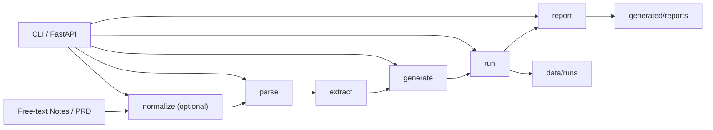

# Playwright TestOps Agent

[简体中文](./README.zh-CN.md) | [Default Landing Page](./README.md)

CLI-first TestOps Agent MVP with a thin FastAPI wrapper for requirement-to-test automation, run artifact querying, and bug report drafting.


## Summary

- CLI-first MVP with a thin FastAPI wrapper over the same Python core functions
- optional `normalize` step before the deterministic core flow: `parse -> extract -> generate -> run -> report`
- file-backed run history and artifact persistence under `data/runs` and `generated/reports`
- honest execution statuses such as `passed`, `failed`, `blocked`, and `environment_error`
- runnable locally, Docker-packaged, and covered by API integration tests

## JD Match

| JD Keyword | Evidence in This Repo |
| --- | --- |
| Python Backend | `app/core`, `app/api` |
| FastAPI | `app/api/main.py` |
| API Design | `GET /healthz`, `GET /api/v1/runs*`, `POST /api/v1/*` |
| Test Automation | Playwright scaffold generation plus local run flow |
| Docker | `Dockerfile`, `docker-compose.yml` |
| Integration Testing | `tests/integration/test_api.py` |
| Artifact Persistence | `data/runs`, `generated/reports` |
| LLM Application | optional `normalize` step in `app/core/normalizer.py` |

## Architecture



## Engineering Evidence

- FastAPI routes exist in `app/api/main.py`, including health, pipeline execution, run history lookup, and artifact lookup.
- Artifacts are persisted on disk under `data/runs`, and generated bug reports are written under `generated/reports`.
- Docker service delivery is present via `Dockerfile`, with `uvicorn app.api.main:app` as the container entrypoint.
- API integration coverage exists in `tests/integration/test_api.py` for health, normalize, generate -> run, run -> report, run lookup, invalid summary skipping, and 404 cases.
- The API layer calls the Python core functions directly instead of shelling out to the CLI.

## Current Scope

The project remains intentionally CLI-first.

Current positioning:
- honest
- runnable
- demoable
- easy to explain in interviews

It solves a narrow TestOps problem: normalize free-text notes when needed, parse structured requirement content, derive deterministic test points, generate conservative Playwright scaffolds, run local scripts, and preserve artifacts plus draft bug reports for later inspection.

Current deliverables include:
- generated Playwright test scaffolds
- run summaries and artifact files under `data/runs`
- bug report markdown under `generated/reports`
- HTTP endpoints for pipeline execution and run/artifact lookup

An optional `normalize` step can run before the deterministic core flow.

The current baseline pipeline is:
- `parse`
- `extract`
- `generate`
- `run`
- `report`

The only LLM-assisted step is `normalize`, which converts free-text notes into parser-compatible PRD markdown before the deterministic downstream flow.

The project now also includes a thin FastAPI wrapper for service-style usage.
The API calls the same Python core functions directly and keeps the existing status semantics such as `blocked` and `environment_error`.

## Project Structure

```text
playwright-testops-agent/
|- app/
|  |- core/
|  |- llm/
|  |- api/
|  |- schemas/
|  |- templates/
|  |- utils/
|  |- config.py
|  |- main.py
|- data/
|  |- inputs/
|  |- expected/
|  |- runs/
|- generated/
|  |- tests/
|  |- reports/
|- docs/
|- tests/
|- README.md
|- README.en.md
|- README.zh-CN.md
|- SPEC.md
|- TASKS.md
|- requirements.txt
|- requirements-core.txt
|- requirements-e2e.txt
|- .env.example
```

## How to Run

1. Create and activate a virtual environment
2. Install dependencies for the CLI and API layers:

```bash
pip install -r requirements-core.txt
```

Playwright-related installation is only needed later for generation/execution stages:

```bash
pip install -r requirements-e2e.txt
```

`requirements.txt` intentionally mirrors the core-only baseline.
If you want the full local setup used for generation and execution flows, install both `requirements-core.txt` and `requirements-e2e.txt`.

3. Check the CLI:

```bash
python -m app.main --help
```

4. Try the sample workflow:

```bash
python -m app.main parse --input data/inputs/sample_prd_login.md
python -m app.main generate --input data/inputs/sample_prd_login.md
python -m app.main run --input tests/assets/runner_pass_case.py
```

5. Try free-text normalization with the deterministic mock provider:

```bash
python -m app.main normalize --input data/inputs/free_text_login_notes.md
python -m app.main normalize --input data/inputs/free_text_search_notes.md --provider mock
```

## Normalization Providers

`mock` remains the default provider. It is deterministic and safe for local tests.

`live` is optional and only applies to `normalize`. To enable it, set all of these environment variables explicitly before running `--provider live`:

```bash
LLM_LIVE_BASE_URL=...
LLM_LIVE_MODEL=...
LLM_LIVE_API_KEY=...
```

Example:

```bash
python -m app.main normalize --input data/inputs/free_text_login_notes.md --provider live
```

If the live provider configuration is missing, normalization fails clearly and does not pretend to succeed.

## Verification

Run the full local test suite:

```bash
pytest -q
```

Run only the API integration tests:

```bash
pytest tests/integration/test_api.py -q
```

## API Usage

The API surface currently includes:
- `GET /healthz`
- `GET /api/v1/runs`
- `GET /api/v1/runs/{run_id}`
- `GET /api/v1/runs/{run_id}/artifacts`
- `POST /api/v1/normalize`
- `POST /api/v1/parse`
- `POST /api/v1/generate`
- `POST /api/v1/run`
- `POST /api/v1/report`

The API does:
- expose the same core pipeline and run artifacts over HTTP
- keep file-backed persistence under `data/runs` and `generated/reports`
- preserve honest statuses such as `blocked`, `failed`, and `environment_error`

The API does not:
- add authentication
- add database-backed state, queues, or async workers
- claim this MVP is a production-grade orchestration platform

Start the API locally:

```bash
uvicorn app.api.main:app --host 127.0.0.1 --port 8000 --reload
```

Health check:

```powershell
curl.exe http://127.0.0.1:8000/healthz
```

Normalize inline free-text notes:

```powershell
curl.exe -X POST "http://127.0.0.1:8000/api/v1/normalize" `
  -H "Content-Type: application/json" `
  -d '{"content":"Login page notes...","filename":"login_notes.md","provider":"mock"}'
```

Parse an existing PRD file:

```powershell
curl.exe -X POST "http://127.0.0.1:8000/api/v1/parse" `
  -H "Content-Type: application/json" `
  -d '{"input_path":"data/inputs/sample_prd_login.md"}'
```

Generate a Playwright scaffold:

```powershell
curl.exe -X POST "http://127.0.0.1:8000/api/v1/generate" `
  -H "Content-Type: application/json" `
  -d '{"input_path":"data/inputs/sample_prd_search.md"}'
```

Run an existing test asset:

```powershell
curl.exe -X POST "http://127.0.0.1:8000/api/v1/run" `
  -H "Content-Type: application/json" `
  -d '{"input_path":"tests/assets/runner_fail_case.py"}'
```

Draft a bug report from a failed run:

```powershell
curl.exe -X POST "http://127.0.0.1:8000/api/v1/report" `
  -H "Content-Type: application/json" `
  -d '{"input_path":"data/runs/<run_id>"}'
```

List stored runs from `data/runs`:

```powershell
curl.exe http://127.0.0.1:8000/api/v1/runs
```

Read one stored run summary from `data/runs/<run_id>/summary.json`:

```powershell
curl.exe http://127.0.0.1:8000/api/v1/runs/<run_id>
```

Read the stored artifact paths for one run:

```powershell
curl.exe http://127.0.0.1:8000/api/v1/runs/<run_id>/artifacts
```

## Docker Usage

Build and start the API container:

```bash
docker compose up --build
```

The container starts the same `uvicorn app.api.main:app` entrypoint and serves the same routes on port `8000`.
The compose file can forward `HEADLESS`, `BASE_URL`, `PLAYWRIGHT_BROWSER`, and the optional `LLM_*` live-provider variables from your local environment.
The compose setup keeps `data/` and `generated/` mounted so run artifacts and generated reports remain on the host filesystem.

## Non-goals

- not a multi-agent platform
- not a production-grade orchestration system
- not a queue-backed async execution service
- not a database-backed testing platform
