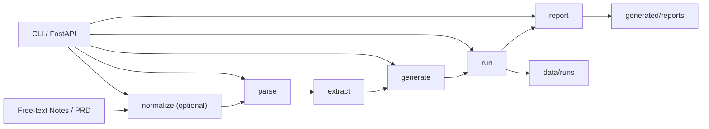

# Playwright TestOps Agent

[简体中文](./README.zh-CN.md) | [English](./README.en.md)

中文：面向测试工程场景的 AI 应用原型：将需求输入收口为测试脚手架、运行记录与缺陷报告草稿。  
English: CLI-first TestOps Agent MVP with a thin FastAPI wrapper for requirement-to-test automation, run artifact querying, and bug report drafting.


## Quick Start / 快速开始

```bash
pip install -r requirements-core.txt
pytest tests/integration/test_api.py -q
uvicorn app.api.main:app --host 127.0.0.1 --port 8000 --reload
```

For full walkthroughs, usage details, and scope notes, see [README.zh-CN.md](./README.zh-CN.md) and [README.en.md](./README.en.md).

## Summary / 项目摘要

- `CLI-first TestOps Agent MVP + thin FastAPI wrapper`
- optional `normalize` step before the deterministic core flow: `parse -> extract -> generate -> run -> report`
- file-backed run history and report persistence under `data/runs` and `generated/reports`
- same Python core reused by both CLI and HTTP routes
- honest execution statuses: `passed`, `failed`, `blocked`, `environment_error`
- Docker packaging and API integration tests are included in the repo

## JD Match / 岗位关键词对齐

| JD Keyword | Evidence in This Repo |
| --- | --- |
| Python Backend | [app/core](./app/core/), [app/api](./app/api/) |
| FastAPI | [app/api/main.py](./app/api/main.py) |
| API Design | [app/api/main.py](./app/api/main.py) |
| Test Automation | [app/core/generator.py](./app/core/generator.py), [app/core/runner.py](./app/core/runner.py) |
| Docker | [Dockerfile](./Dockerfile), [docker-compose.yml](./docker-compose.yml) |
| Integration Testing | [tests/integration/test_api.py](./tests/integration/test_api.py) |
| Artifact Persistence | [data/runs](./data/runs/), [generated/reports](./generated/reports/) |
| LLM Application | [app/core/normalizer.py](./app/core/normalizer.py) |

## Architecture / 架构概览



## Engineering Evidence / 工程证据

- FastAPI routes exist in `app/api/main.py`, including pipeline endpoints and run/artifact lookup endpoints.
- Artifacts are persisted on disk under `data/runs`, and generated bug reports are written under `generated/reports`.
- Docker service delivery is present via `Dockerfile`, with `uvicorn app.api.main:app` as the container entrypoint.
- API integration coverage exists in `tests/integration/test_api.py` for health, normalize, generate -> run, run -> report, run lookup, invalid summary skipping, and 404 cases.
- The API layer calls the Python core functions directly instead of shelling out to the CLI.

## Scope / Non-goals / 边界说明

- This repo is a CLI-first MVP, not a production-grade orchestration system.
- `normalize` is optional and is the only LLM-assisted step.
- `/api/v1/run` is synchronous, not a queue-backed async execution service.
- Persistence is file-backed, not Redis-backed, MySQL-backed, or otherwise database-backed.
- No frontend, authentication layer, or multi-agent platform is claimed here.

## Documentation / 文档入口

- Full Chinese documentation: [README.zh-CN.md](./README.zh-CN.md)
- Full English documentation: [README.en.md](./README.en.md)
- Technical spec: [SPEC.md](./SPEC.md)
- Historical roadmap: [TASKS.md](./TASKS.md)
- License: [LICENSE](./LICENSE)
