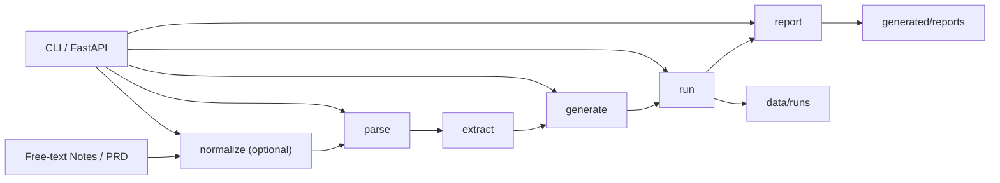

# Playwright TestOps Agent

[English](./README.en.md) | [默认首页](./README.md)

一个面向真实测试流程的 Playwright 工作流项目：把需求说明收口为可检查的测试脚手架、本地运行记录和缺陷报告草稿。

[](./app/core/)
[](./app/api/main.py)
[](./generated/tests/)
[](./data/runs/)
[](./Dockerfile)
[](./tests/integration/test_api.py)

## 这个项目解决什么真实测试问题

真实测试流程里的输入往往来自 PRD、自由文本笔记或半结构化需求说明。这个仓库把这些输入收口成三类可检查产物：保守的 Playwright 测试脚手架、可追溯的运行产物，以及基于运行结果生成的缺陷报告草稿。重点不是堆平台概念，而是让每一步都有文件证据、状态诚实、便于人工接手。

## 当前已经做成什么

- 可选 `normalize` 之后，主流程已经能走通 `parse -> extract -> generate -> run -> report`。
- CLI 主入口已经覆盖 `normalize`、`parse`、`generate`、`run`、`report`。
- 轻量 FastAPI 包装层直接复用 Python 核心函数，提供 health、流程执行、run 查询与 artifact 查询接口。
- 生成脚手架、运行摘要与报告草稿都会直接落盘到 `generated/tests`、`data/runs` 和 `generated/reports`。
- 仓库里已经有 Docker 打包入口、compose 配置和 API 集成测试。

## 一个真实样例

下面用两条独立证据链展示当前仓库里的真实输出。它们不是同一条连续的 end-to-end run，而是分别证明“PRD -> 脚手架生成 -> blocked run”与“failure-path run -> bug report draft”这两段行为。

### 样例 A：PRD -> generated scaffold -> blocked run

1. 输入 PRD：[data/inputs/sample_prd_login.md](./data/inputs/sample_prd_login.md)

```md
## Feature Name
User Login

## Page URL
/login
```

2. 生成脚手架：[generated/tests/test_login_generated.py](./generated/tests/test_login_generated.py)

```python
# Generated from: Login Page PRD
target_url = BASE_URL.rstrip("/") + "/login"
page.goto(target_url)
# TODO: Locate the relevant input selector before implementing...
```

3. 对生成脚手架的诚实运行状态：[data/runs/20260422T143848670135Z_test_login_generated/summary.json](./data/runs/20260422T143848670135Z_test_login_generated/summary.json)

```json
"status": "blocked",
"reason": "Script contains incomplete implementation markers (TODO) and is not ready for honest execution."
```

### 样例 B：独立 failure-path run -> bug report draft

这一步已经切换到另一条独立证据链，不再沿用上面的 `sample_prd_login.md` / `test_login_generated.py` 链路。

1. 失败 run 的记录：[summary.json](./data/runs/20260422T143848683010Z_runner_fail_case/summary.json)

2. 对应的报告草稿：[bug report draft](./generated/reports/bug_report_20260422T143848683010Z_runner_fail_case.md)

```text
status: failed
FAILED tests/assets/runner_fail_case.py::test_minimal_fail_case - assert 1 == 2
```

## 工程证据

- FastAPI 路由已经存在于 `app/api/main.py`，包括 health、pipeline execution、run 查询与 artifact 查询。
- 运行产物落盘到 `data/runs`，缺陷报告输出到 `generated/reports`。
- Docker 启动入口已经写在 `Dockerfile` 中，容器使用 `uvicorn app.api.main:app` 启动服务。
- API 集成测试已经覆盖 `health`、`normalize`、`generate -> run`、`run -> report`、run lookup、坏 summary 跳过和 `404` 场景。
- API 层直接调用 Python 核心函数，而不是通过 shell 再调用 CLI。

## 项目定位与当前范围

- 当前实现仍然是 `CLI-first TestOps Agent MVP + thin FastAPI wrapper`
- 可选的 `normalize` 步骤发生在确定性主流程之前，也是当前唯一的 LLM 辅助步骤
- 确定性主流程是：`parse -> extract -> generate -> run -> report`
- 当前运行产物与报告持久化仍然使用文件系统：`data/runs`、`generated/reports`
- `/api/v1/run` 仍然是同步执行，不是队列或 worker 驱动的异步任务平台

## 核心流程



## 当前 API 能力

当前 API 路由包括：
- `GET /healthz`
- `GET /api/v1/runs`
- `GET /api/v1/runs/{run_id}`
- `GET /api/v1/runs/{run_id}/artifacts`
- `POST /api/v1/normalize`
- `POST /api/v1/parse`
- `POST /api/v1/generate`
- `POST /api/v1/run`
- `POST /api/v1/report`

API 目前能做什么：
- 通过 HTTP 暴露相同的核心流程
- 继续使用文件系统保存运行产物
- 保留 `blocked`、`failed`、`environment_error` 这类诚实状态

API 目前不声称什么：
- 不包含认证
- 不包含数据库状态
- 不包含队列、worker 或异步任务调度
- 不把当前实现包装成生产级测试平台

## 项目结构

```text
playwright-testops-agent/
|- app/
|  |- core/
|  |- llm/
|  |- api/
|  |- schemas/
|  |- templates/
|  |- utils/
|  |- config.py
|  |- main.py
|- data/
|  |- inputs/
|  |- expected/
|  |- runs/
|- generated/
|  |- tests/
|  |- reports/
|- docs/
|- tests/
|- README.md
|- README.en.md
|- README.zh-CN.md
|- SPEC.md
|- TASKS.md
|- requirements.txt
|- requirements-core.txt
|- requirements-e2e.txt
|- .env.example
```

## 本地运行

1. 创建并激活虚拟环境

```powershell
python -m venv .venv
.venv\Scripts\Activate.ps1
```

2. 安装 CLI 和 API 所需依赖：

```bash
python -m pip install -r requirements-core.txt
```

只有在后续生成/执行相关流程时，才需要 Playwright 相关依赖：

```bash
python -m pip install -r requirements-e2e.txt
```

`requirements.txt` 目前刻意保持为 core-only baseline。
如果你想得到本地完整运行环境，请同时安装 `requirements-core.txt` 和 `requirements-e2e.txt`。

3. 检查 CLI：

```bash
python -m app.main --help
```

4. 试跑样例流程：

```bash
python -m app.main parse --input data/inputs/sample_prd_login.md
python -m app.main generate --input data/inputs/sample_prd_login.md
python -m app.main run --input tests/assets/runner_pass_case.py
```

5. 使用 deterministic mock provider 试跑自由文本 `normalize`：

```bash
python -m app.main normalize --input data/inputs/free_text_login_notes.md
python -m app.main normalize --input data/inputs/free_text_search_notes.md --provider mock
```

## normalize 提供方

`mock` 仍然是默认 provider。它是 deterministic 的，适合本地测试。

`live` 是可选项，而且只用于 `normalize`。如果要启用 `--provider live`，需要先在 PowerShell 中显式设置这些环境变量：

```powershell
$env:LLM_LIVE_BASE_URL="..."
$env:LLM_LIVE_MODEL="..."
$env:LLM_LIVE_API_KEY="..."
```

示例：

```bash
python -m app.main normalize --input data/inputs/free_text_login_notes.md --provider live
```

如果 live provider 配置不完整，`normalize` 会明确失败，而不是伪装成功。

## 测试与验证

运行完整本地测试：

```bash
python -m pytest -q
```

只运行 API 集成测试：

```bash
python -m pytest tests/integration/test_api.py -q
```

## API 使用

本地开发模式启动 API：

```bash
python -m uvicorn app.api.main:app --host 127.0.0.1 --port 8000 --reload
```

健康检查：

```powershell
curl.exe http://127.0.0.1:8000/healthz
```

提交自由文本做 `normalize`：

```powershell
curl.exe -X POST "http://127.0.0.1:8000/api/v1/normalize" `
  -H "Content-Type: application/json" `
  -d '{"content":"Login page notes...","filename":"login_notes.md","provider":"mock"}'
```

解析已有 PRD 文件：

```powershell
curl.exe -X POST "http://127.0.0.1:8000/api/v1/parse" `
  -H "Content-Type: application/json" `
  -d '{"input_path":"data/inputs/sample_prd_login.md"}'
```

生成 Playwright 脚手架：

```powershell
curl.exe -X POST "http://127.0.0.1:8000/api/v1/generate" `
  -H "Content-Type: application/json" `
  -d '{"input_path":"data/inputs/sample_prd_search.md"}'
```

运行已有测试资产：

```powershell
curl.exe -X POST "http://127.0.0.1:8000/api/v1/run" `
  -H "Content-Type: application/json" `
  -d '{"input_path":"tests/assets/runner_fail_case.py"}'
```

根据失败 run 生成 bug report：

```powershell
curl.exe -X POST "http://127.0.0.1:8000/api/v1/report" `
  -H "Content-Type: application/json" `
  -d '{"input_path":"data/runs/<run_id>"}'
```

查看 `data/runs` 下的 run 列表：

```powershell
curl.exe http://127.0.0.1:8000/api/v1/runs
```

读取某个 run 的 summary：

```powershell
curl.exe http://127.0.0.1:8000/api/v1/runs/<run_id>
```

读取某个 run 的 artifact 路径：

```powershell
curl.exe http://127.0.0.1:8000/api/v1/runs/<run_id>/artifacts
```

## Docker 使用

构建并启动 API 容器：

```bash
docker compose up --build
```

容器中会使用相同的 `uvicorn app.api.main:app` 入口，并在 `8000` 端口提供相同路由。
`docker-compose.yml` 当前可以转发 `HEADLESS`、`BASE_URL`、`PLAYWRIGHT_BROWSER` 和可选的 `LLM_*` live-provider 变量。
`data/` 与 `generated/` 会挂载回宿主机，因此 run artifacts 与报告会保留在本地文件系统中。

## 边界 / 不做什么

- 不是多 Agent 平台
- 不是生产级编排系统
- 不是队列驱动的异步执行服务
- 不是数据库驱动的测试平台
