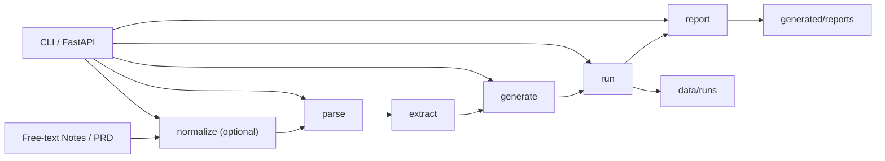

# Playwright TestOps Agent

[English](./README.en.md) | [默认首页](./README.md)

面向测试工程场景的 AI 应用原型：将需求输入收口为测试脚手架、运行记录与缺陷报告草稿。


## 项目定位

- 这是一个 `CLI-first TestOps Agent MVP + thin FastAPI wrapper`
- 可选的 `normalize` 步骤发生在确定性主流程之前
- 确定性主流程是：`parse -> extract -> generate -> run -> report`
- 当前 artifacts 与报告持久化仍然使用文件系统：`data/runs`、`generated/reports`
- `/api/v1/run` 仍然是同步执行，不是队列或 worker 驱动的异步任务平台

## 项目摘要

这个仓库聚焦一个收口明确的 TestOps 问题：把需求输入整理成保守的 Playwright 测试脚手架、本地运行记录和缺陷报告草稿，同时保证产物可检查、状态诚实、边界清楚。

当前已经交付的内容包括：
- CLI 主入口与可运行的核心流程
- thin FastAPI wrapper，直接复用 Python core functions
- run history 与 artifact 查询接口
- Docker 打包入口
- API 集成测试

## 岗位关键词对齐

| JD 关键词 | 仓库内证据 |
| --- | --- |
| Python Backend | `app/core`, `app/api` |
| FastAPI | `app/api/main.py` |
| API 设计 | `GET /healthz`, `GET /api/v1/runs*`, `POST /api/v1/*` |
| 测试自动化 | Playwright 脚手架生成 + 本地 run 流程 |
| Docker | `Dockerfile`, `docker-compose.yml` |
| 集成测试 | `tests/integration/test_api.py` |
| Artifact 持久化 | `data/runs`, `generated/reports` |
| LLM 应用 | 可选 `normalize` 步骤 |

## 核心流程



## 工程证据

- FastAPI 路由已经存在于 `app/api/main.py`，包括 health、pipeline execution、run 查询与 artifact 查询。
- 运行产物落盘到 `data/runs`，缺陷报告输出到 `generated/reports`。
- Docker 启动入口已经写在 `Dockerfile` 中，容器使用 `uvicorn app.api.main:app` 启动服务。
- API 集成测试已经覆盖 `health`、`normalize`、`generate -> run`、`run -> report`、run lookup、坏 summary 跳过和 `404` 场景。
- API 层直接调用 Python core functions，而不是通过 shell 再调用 CLI。

## 当前范围

项目仍然刻意保持为 CLI-first。

当前定位：
- honest
- runnable
- demoable
- easy to explain in interviews

它解决的是一个窄范围的 TestOps 问题：在需要时先做 `normalize`，然后解析结构化需求、抽取测试点、生成保守的 Playwright 脚手架、运行本地脚本，并保留 artifacts 与缺陷报告草稿供后续检查。

当前已经有的交付物包括：
- 生成的 Playwright 测试脚手架
- `data/runs` 下的运行摘要和 artifact 文件
- `generated/reports` 下的 bug report markdown
- 用于流程执行与 run/artifact 查询的 HTTP API

可选的 `normalize` 步骤发生在确定性核心流程之前。

当前确定性主流程是：
- `parse`
- `extract`
- `generate`
- `run`
- `report`

`normalize` 是当前唯一的 LLM-assisted step，它的作用是把自由文本需求整理为后续解析流程可以接受的 PRD markdown。

## 当前 API 能力

当前 API 路由包括：
- `GET /healthz`
- `GET /api/v1/runs`
- `GET /api/v1/runs/{run_id}`
- `GET /api/v1/runs/{run_id}/artifacts`
- `POST /api/v1/normalize`
- `POST /api/v1/parse`
- `POST /api/v1/generate`
- `POST /api/v1/run`
- `POST /api/v1/report`

API 目前能做什么：
- 通过 HTTP 暴露相同的核心流程
- 继续使用文件系统保存运行产物
- 保留 `blocked`、`failed`、`environment_error` 这类诚实状态

API 目前不声称什么：
- 不包含认证
- 不包含数据库状态
- 不包含队列、worker 或异步任务调度
- 不把这个 MVP 包装成生产级测试平台

## 项目结构

```text
playwright-testops-agent/
|- app/
|  |- core/
|  |- llm/
|  |- api/
|  |- schemas/
|  |- templates/
|  |- utils/
|  |- config.py
|  |- main.py
|- data/
|  |- inputs/
|  |- expected/
|  |- runs/
|- generated/
|  |- tests/
|  |- reports/
|- docs/
|- tests/
|- README.md
|- README.en.md
|- README.zh-CN.md
|- SPEC.md
|- TASKS.md
|- requirements.txt
|- requirements-core.txt
|- requirements-e2e.txt
|- .env.example
```

## 本地运行

1. 创建并激活虚拟环境
2. 安装 CLI 和 API 所需依赖：

```bash
pip install -r requirements-core.txt
```

只有在后续生成/执行相关流程时，才需要 Playwright 相关依赖：

```bash
pip install -r requirements-e2e.txt
```

`requirements.txt` 目前刻意保持为 core-only baseline。
如果你想得到本地完整运行环境，请同时安装 `requirements-core.txt` 和 `requirements-e2e.txt`。

3. 检查 CLI：

```bash
python -m app.main --help
```

4. 试跑样例流程：

```bash
python -m app.main parse --input data/inputs/sample_prd_login.md
python -m app.main generate --input data/inputs/sample_prd_login.md
python -m app.main run --input tests/assets/runner_pass_case.py
```

5. 使用 deterministic mock provider 试跑自由文本 `normalize`：

```bash
python -m app.main normalize --input data/inputs/free_text_login_notes.md
python -m app.main normalize --input data/inputs/free_text_search_notes.md --provider mock
```

## normalize 提供方

`mock` 仍然是默认 provider。它是 deterministic 的，适合本地测试。

`live` 是可选项，而且只用于 `normalize`。如果要启用 `--provider live`，需要先显式设置这些环境变量：

```bash
LLM_LIVE_BASE_URL=...
LLM_LIVE_MODEL=...
LLM_LIVE_API_KEY=...
```

示例：

```bash
python -m app.main normalize --input data/inputs/free_text_login_notes.md --provider live
```

如果 live provider 配置不完整，`normalize` 会明确失败，而不是伪装成功。

## 测试与验证

运行完整本地测试：

```bash
pytest -q
```

只运行 API 集成测试：

```bash
pytest tests/integration/test_api.py -q
```

## API 使用

本地启动 API：

```bash
uvicorn app.api.main:app --host 127.0.0.1 --port 8000 --reload
```

健康检查：

```powershell
curl.exe http://127.0.0.1:8000/healthz
```

提交自由文本做 `normalize`：

```powershell
curl.exe -X POST "http://127.0.0.1:8000/api/v1/normalize" `
  -H "Content-Type: application/json" `
  -d '{"content":"Login page notes...","filename":"login_notes.md","provider":"mock"}'
```

解析已有 PRD 文件：

```powershell
curl.exe -X POST "http://127.0.0.1:8000/api/v1/parse" `
  -H "Content-Type: application/json" `
  -d '{"input_path":"data/inputs/sample_prd_login.md"}'
```

生成 Playwright 脚手架：

```powershell
curl.exe -X POST "http://127.0.0.1:8000/api/v1/generate" `
  -H "Content-Type: application/json" `
  -d '{"input_path":"data/inputs/sample_prd_search.md"}'
```

运行已有测试资产：

```powershell
curl.exe -X POST "http://127.0.0.1:8000/api/v1/run" `
  -H "Content-Type: application/json" `
  -d '{"input_path":"tests/assets/runner_fail_case.py"}'
```

根据失败 run 生成 bug report：

```powershell
curl.exe -X POST "http://127.0.0.1:8000/api/v1/report" `
  -H "Content-Type: application/json" `
  -d '{"input_path":"data/runs/<run_id>"}'
```

查看 `data/runs` 下的 run 列表：

```powershell
curl.exe http://127.0.0.1:8000/api/v1/runs
```

读取某个 run 的 summary：

```powershell
curl.exe http://127.0.0.1:8000/api/v1/runs/<run_id>
```

读取某个 run 的 artifact 路径：

```powershell
curl.exe http://127.0.0.1:8000/api/v1/runs/<run_id>/artifacts
```

## Docker 使用

构建并启动 API 容器：

```bash
docker compose up --build
```

容器中会使用相同的 `uvicorn app.api.main:app` 入口，并在 `8000` 端口提供相同路由。
`docker-compose.yml` 当前可以转发 `HEADLESS`、`BASE_URL`、`PLAYWRIGHT_BROWSER` 和可选的 `LLM_*` live-provider 变量。
`data/` 与 `generated/` 会挂载回宿主机，因此 run artifacts 与报告会保留在本地文件系统中。

## 边界 / 不做什么

- 不是 multi-agent platform
- 不是 production-grade orchestration system
- 不是 queue-backed async execution service
- 不是 database-backed testing platform
