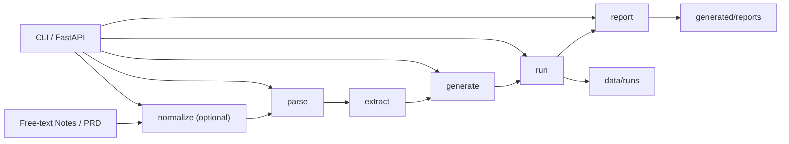

# Playwright TestOps Agent

[English](./README.en.md) | [默认首页](./README.md)

一个面向真实测试流程的 Playwright 工作流项目：把需求说明收口为可检查的测试脚手架、本地运行记录和缺陷报告草稿。

[](./app/core/)
[](./app/api/main.py)
[](./app/core/generator.py)
[](./app/core/runner.py)
[](./Dockerfile)
[](./tests/integration/test_api.py)

## 这个项目解决什么真实测试问题

真实测试流程里的输入往往来自 PRD、自由文本笔记或半结构化需求说明。这个仓库把这些输入收口成三类可检查产物：保守的 Playwright 测试脚手架、可追溯的运行产物，以及基于运行结果生成的缺陷报告草稿。重点不是堆平台概念，而是让每一步都有文件证据、状态诚实、便于人工接手。

## 当前已经做成什么

- 可选 `normalize` 之后，主流程已经能走通 `parse -> extract -> generate -> run -> report`。
- CLI 主入口已经覆盖 `normalize`、`parse`、`generate`、`run`、`report`。
- 轻量 FastAPI 包装层直接复用 Python 核心函数，提供 health、流程执行、run 查询与 artifact 查询接口。
- Agent run 接口已经支持 `input_path` 或 `task_text`，能记录 trace、分析信息需求、支持人工审批节点，并提供本地 file-backed KB ingest/search。
- 生成脚手架、运行摘要与报告草稿都会在运行时落盘到 `generated/tests/`、`data/runs/` 和 `generated/reports/`。这些输出可以本地复现，但不会作为固定公开样例提交。
- 仓库里已经有 Docker 打包入口、compose 配置和 API 集成测试。

## 一个真实样例

下面的样例刻意改成“命令可复现”而不是“仓库里已有固定产物可点开”。公开 README 只链接已提交的源码、测试、contract 和输入 PRD。`generated/tests/`、`data/runs/`、`generated/reports/` 下的内容属于运行时产物，需要你本地生成。

### 样例 A：PRD -> generated login test -> 本地运行

1. 输入 PRD：[data/inputs/sample_prd_login.md](./data/inputs/sample_prd_login.md)

```md
## Feature Name
User Login

## Page URL
/login
```

2. 稳定实现证据：[app/core/generator.py](./app/core/generator.py)、[app/core/selector_contract.py](./app/core/selector_contract.py)、[data/contracts/demo_app_selectors.json](./data/contracts/demo_app_selectors.json)、[data/contracts/demo_app_test_data.json](./data/contracts/demo_app_test_data.json)、[tests/unit/test_generator.py](./tests/unit/test_generator.py)

3. 在本地复现 generated login test：

```powershell
python -m app.main generate --input data/inputs/sample_prd_login.md
python -m pytest generated/tests/test_login_generated.py -q
python -m app.main run generated/tests/test_login_generated.py
```

生成出的脚本和 run 目录都是 runtime output，公开仓库不会把它们作为固定样例文件提交。

### 样例 B：独立 failure-path run -> report draft

这一步切换到另一条独立证据链，不再沿用上面的 login 生成链路。

1. 稳定失败路径证据：[tests/assets/runner_fail_case.py](./tests/assets/runner_fail_case.py)、[app/core/runner.py](./app/core/runner.py)、[tests/integration/test_pipeline.py](./tests/integration/test_pipeline.py)、[tests/integration/test_api.py](./tests/integration/test_api.py)

2. 在本地复现 failure-path run 和报告生成：

```powershell
python -m app.main run --input tests/assets/runner_fail_case.py
python -m app.main report --input data/runs/<run_id>
```

`generated/reports/` 下的报告文件同样属于 runtime output，而不是公开仓库里的固定样例。

## 工程证据

- [app/core/generator.py](./app/core/generator.py)、[app/core/runner.py](./app/core/runner.py)、[app/core/selector_contract.py](./app/core/selector_contract.py) 实现了生成、运行状态判定和 selector contract 加载。
- [data/contracts/demo_app_selectors.json](./data/contracts/demo_app_selectors.json) 与 [data/contracts/demo_app_test_data.json](./data/contracts/demo_app_test_data.json) 让 selector 和 fixture 来源保持 file-backed。
- [demo_app/main.py](./demo_app/main.py) 是 executable login flow 使用的本地 demo target。
- [tests/unit/test_generator.py](./tests/unit/test_generator.py)、[tests/unit/test_runner.py](./tests/unit/test_runner.py)、[tests/demo/test_demo_app.py](./tests/demo/test_demo_app.py) 验证 generator、runner 和 demo app 行为。
- [tests/integration/test_api.py](./tests/integration/test_api.py) 与 [tests/integration/test_pipeline.py](./tests/integration/test_pipeline.py) 覆盖 API 和 pipeline 层集成路径。

## 项目定位与当前范围

- 当前实现仍然是 `CLI-first TestOps Agent MVP + thin FastAPI wrapper`
- 可选的 `normalize` 步骤发生在确定性主流程之前，也是当前唯一的 LLM 辅助步骤
- 确定性主流程是：`parse -> extract -> generate -> run -> report`
- 当前运行产物与报告持久化仍然使用文件系统：`data/runs`、`generated/reports`
- 当前 KB 检索也是 file-backed：`data/kb/index.json` 记录索引，`data/kb/uploaded/` 保存 API 上传内容
- 当前 Agent checkpoint 是 `trace.json + resume_state`，不是 LangGraph 原生 durable execution
- `/api/v1/run` 仍然是同步执行，不是队列或 worker 驱动的异步任务平台

## 核心流程



## 当前 API 能力

当前 API 路由包括：
- `GET /healthz`
- `GET /api/v1/runs`
- `GET /api/v1/runs/{run_id}`
- `GET /api/v1/runs/{run_id}/artifacts`
- `POST /api/v1/agent-runs`
- `GET /api/v1/agent-runs/{agent_run_id}`
- `GET /api/v1/agent-runs/{agent_run_id}/trace`
- `POST /api/v1/agent-runs/{agent_run_id}/approvals`
- `POST /api/v1/agent-runs/{agent_run_id}/approve`
- `POST /api/v1/kb/ingest`
- `GET /api/v1/kb/search`
- `POST /api/v1/normalize`
- `POST /api/v1/parse`
- `POST /api/v1/generate`
- `POST /api/v1/run`
- `POST /api/v1/report`

API 目前能做什么：
- 通过 HTTP 暴露相同的核心流程
- 继续使用文件系统保存运行产物
- 通过 `agent-runs` 保存 Agent 决策轨迹，并用审批接口恢复人工确认后的流程
- 通过本地文件索引做确定性 KB 检索
- 通过 `task_text` 提交测试任务，并由 Agent 记录 `information_needs` 决定检索哪些上下文类型
- 保留 `blocked`、`failed`、`environment_error` 这类诚实状态

API 目前不声称什么：
- 不包含认证
- 不包含数据库状态
- 不包含队列、worker 或异步任务调度
- 不包含生产级向量数据库或 LangChain 向量检索
- 不声称 LLM 已负责测试计划生成；当前计划生成是 deterministic scaffold
- 不声称 LangGraph 原生 checkpoint 或 durable execution
- 不把当前实现包装成生产级测试平台

## 项目结构

```text
playwright-testops-agent/
|- app/
|  |- core/
|  |- llm/
|  |- api/
|  |- schemas/
|  |- templates/
|  |- utils/
|  |- config.py
|  |- main.py
|- data/
|  |- inputs/
|  |- expected/
|  |- runs/
|- generated/
|  |- tests/
|  |- reports/
|- docs/
|- tests/
|- README.md
|- README.en.md
|- README.zh-CN.md
|- SPEC.md
|- TASKS.md
|- requirements.txt
|- requirements-core.txt
|- requirements-e2e.txt
|- .env.example
```

## 本地运行

1. 创建并激活虚拟环境

```powershell
python -m venv .venv
.venv\Scripts\Activate.ps1
```

2. 安装 CLI 和 API 所需依赖：

```bash
python -m pip install -r requirements-core.txt
```

只有在后续生成/执行相关流程时，才需要 Playwright 相关依赖：

```bash
python -m pip install -r requirements-e2e.txt
```

`requirements.txt` 目前刻意保持为 core-only baseline。
如果你想得到本地完整运行环境，请同时安装 `requirements-core.txt` 和 `requirements-e2e.txt`。

3. 检查 CLI：

```bash
python -m app.main --help
```

4. 试跑样例流程：

```bash
python -m app.main parse --input data/inputs/sample_prd_login.md
python -m app.main generate --input data/inputs/sample_prd_login.md
python -m app.main run --input tests/assets/runner_pass_case.py
```

5. 使用 deterministic mock provider 试跑自由文本 `normalize`：

```bash
python -m app.main normalize --input data/inputs/free_text_login_notes.md
python -m app.main normalize --input data/inputs/free_text_search_notes.md --provider mock
```

## normalize 提供方

`mock` 仍然是默认 provider。它是 deterministic 的，适合本地测试。

`live` 是可选项，而且只用于 `normalize`。如果要启用 `--provider live`，需要先在 PowerShell 中显式设置这些环境变量：

```powershell
$env:LLM_LIVE_BASE_URL="..."
$env:LLM_LIVE_MODEL="..."
$env:LLM_LIVE_API_KEY="..."
```

示例：

```bash
python -m app.main normalize --input data/inputs/free_text_login_notes.md --provider live
```

如果 live provider 配置不完整，`normalize` 会明确失败，而不是伪装成功。

## 测试与验证

运行完整本地测试：

```bash
python -m pytest -q
```

只运行 API 集成测试：

```bash
python -m pytest tests/integration/test_api.py -q
```

## API 使用

本地开发模式启动 API：

```bash
python -m uvicorn app.api.main:app --host 127.0.0.1 --port 8000 --reload
```

健康检查：

```powershell
curl.exe http://127.0.0.1:8000/healthz
```

提交自由文本做 `normalize`：

```powershell
curl.exe -X POST "http://127.0.0.1:8000/api/v1/normalize" `
  -H "Content-Type: application/json" `
  -d '{"content":"Login page notes...","filename":"login_notes.md","provider":"mock"}'
```

解析已有 PRD 文件：

```powershell
curl.exe -X POST "http://127.0.0.1:8000/api/v1/parse" `
  -H "Content-Type: application/json" `
  -d '{"input_path":"data/inputs/sample_prd_login.md"}'
```

生成 Playwright 脚手架：

```powershell
curl.exe -X POST "http://127.0.0.1:8000/api/v1/generate" `
  -H "Content-Type: application/json" `
  -d '{"input_path":"data/inputs/sample_prd_search.md"}'
```

运行已有测试资产：

```powershell
curl.exe -X POST "http://127.0.0.1:8000/api/v1/run" `
  -H "Content-Type: application/json" `
  -d '{"input_path":"tests/assets/runner_fail_case.py"}'
```

根据失败 run 生成 bug report：

```powershell
curl.exe -X POST "http://127.0.0.1:8000/api/v1/report" `
  -H "Content-Type: application/json" `
  -d '{"input_path":"data/runs/<run_id>"}'
```

查看 `data/runs` 下的 run 列表：

```powershell
curl.exe http://127.0.0.1:8000/api/v1/runs
```

读取某个 run 的 summary：

```powershell
curl.exe http://127.0.0.1:8000/api/v1/runs/<run_id>
```

读取某个 run 的 artifact 路径：

```powershell
curl.exe http://127.0.0.1:8000/api/v1/runs/<run_id>/artifacts
```

创建 manual agent run：

```powershell
curl.exe -X POST "http://127.0.0.1:8000/api/v1/agent-runs" `
  -H "Content-Type: application/json" `
  -d '{"input_path":"data/inputs/sample_prd_login.md","approval_mode":"manual"}'
```

用自然语言测试任务创建 agent run：

```powershell
curl.exe -X POST "http://127.0.0.1:8000/api/v1/agent-runs" `
  -H "Content-Type: application/json" `
  -d '{"task_text":"Verify login happy path with valid credentials.","target_url":"/login","module":"login","constraints":["Use selector contracts"]}'
```

查询 agent run 列表：

```powershell
curl.exe "http://127.0.0.1:8000/api/v1/agent-runs?final_status=passed&module=login&limit=20"
```

审批当前等待的 gate。`/approve` 是 `/approvals` 的兼容别名：

```powershell
curl.exe -X POST "http://127.0.0.1:8000/api/v1/agent-runs/<agent_run_id>/approve" `
  -H "Content-Type: application/json" `
  -d '{"gate":"test_plan","decision":"approved","reviewer":"local"}'
```

写入本地 KB 索引：

```powershell
curl.exe -X POST "http://127.0.0.1:8000/api/v1/kb/ingest" `
  -H "Content-Type: application/json" `
  -d '{"source_type":"note","content":"Login page requires stable selector contracts.","metadata":{"module":"login"}}'
```

检索本地 KB：

```powershell
curl.exe "http://127.0.0.1:8000/api/v1/kb/search?query=login%20selector&max_results=5"
```

## Docker 使用

构建并启动 API 容器：

```bash
docker compose up --build
```

容器中会使用相同的 `uvicorn app.api.main:app` 入口，并在 `8000` 端口提供相同路由。
`docker-compose.yml` 当前可以转发 `HEADLESS`、`BASE_URL`、`PLAYWRIGHT_BROWSER` 和可选的 `LLM_*` live-provider 变量。
`data/` 与 `generated/` 会挂载回宿主机，因此 run artifacts 与报告会保留在本地文件系统中。

## 边界 / 不做什么

- 不是多 Agent 平台
- 不是生产级编排系统
- 不是队列驱动的异步执行服务
- 不是数据库驱动的测试平台

## CI 验证

[.github/workflows/ci.yml](./.github/workflows/ci.yml) 在每次 push 和 PR 到 main 时运行：

- 安装 core 和 e2e 依赖
- 安装 Playwright Chromium
- 运行 demo app tests
- 运行 unit tests
- 运行 integration tests
- 生成 login test
- 运行 generated login test
- 通过 CLI runner 运行 generated login test
